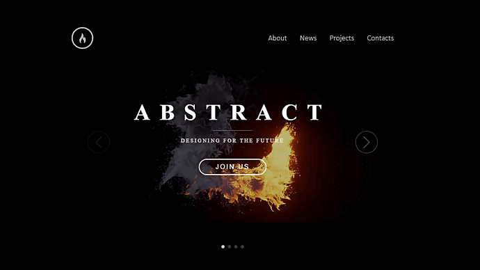

# Проект: Одностраничный сайт с видео-слайдером

## Описание

Этот проект представляет собой одностраничный сайт, где реализован слайдер с помощью библиотеки [Swiper](https://swiperjs.com/). При переключении между слайдами на заднем фоне происходит воспроизведение видео, синхронизированное с анимацией перехода между слайдами. Каждый слайд запускает соответствующую часть видео, создавая плавный визуальный эффект.

### Основные функции:

- **Слайдер на основе Swiper**: Используется популярная библиотека Swiper для создания интерактивного слайдера.
- **Видео на фоне**: Видео воспроизводится на заднем фоне при переключении слайдов, создавая эффект продолжения анимации.
- **Цикличность**: Видео и слайды переходят циклично, обеспечивая бесшовный переход между всеми элементами.

## Демо

Ниже представлена анимация, демонстрирующая работу слайдера:



## Установка и запуск

1. Склонируйте репозиторий на свой локальный компьютер:
   ```bash
   git clone https://github.com/ваш_репозиторий/ваш_проект.git
